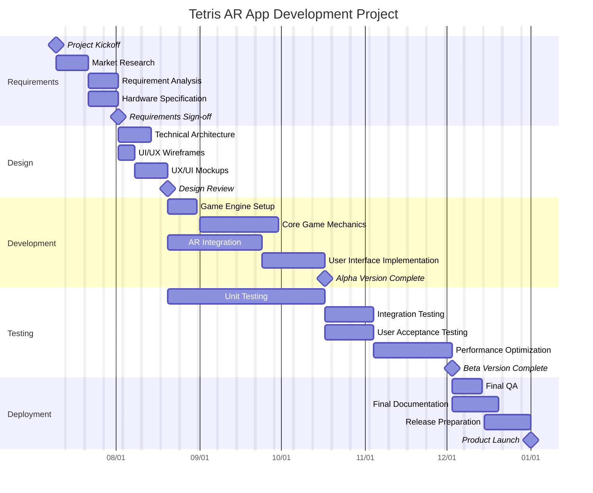

# Tetris AR App Project Plan

## Project Overview

This project aims to develop a Tetris game for AR glasses. The application will transform the classic 2D Tetris experience into an immersive 3D augmented reality game where blocks appear in the user's physical space. The game will utilize gesture controls and head movements for gameplay, targeting AR early adopters and casual gamers. Development will focus on core Tetris mechanics, AR integration, intuitive controls, and basic multiplayer functionality, with a 6-month development timeline.

## Gantt Chart

# Task 2: Cost Estimation and Pricing Strategy

## Project Cost Estimation

### Development Costs
| Phase | Team Size | Duration | Person-Months | Cost (€5,000/month) |
|-------|-----------|----------|--------------|---------------------|
| Requirements | 2 | 1 month | 2 | €10,000 |
| Design | 3 | 1.5 months | 4.5 | €22,500 |
| Development | 4 | 3 months | 12 | €60,000 |
| Testing | 3 | 2.5 months | 7.5 | €37,500 |
| Deployment | 2 | 1 month | 2 | €10,000 |
| **Total Personnel** | | | **28** | **€140,000** |

### Additional Costs
- AR Development Hardware: €9,000
- Software Licenses: €5,000
- Marketing Campaign: €50,000
- Overhead (50%): €70,000

### Total Project Cost
**€274,000**

## Pricing Strategy: Free-to-Play with Microtransactions

I would implement a free-to-play model with in-app purchases for the Tetris AR app. This approach offers the highest revenue potential for this type of game.

### Monetization Elements
- **Cosmetic Items**: Custom block skins, environments (€1.99-4.99)
- **Gameplay Enhancements**: Power-ups, game modes (€0.99-5.99)
- **Rewarded Advertising**: Watch optional ads to earn in-game currency or power-ups
- **In-game Advertising**: Banner and interstitial ads for non-paying users

### User Acquisition Strategy
- Launch marketing campaign: €50,000 (app store optimization, digital advertising, influencer partnerships)
- Target 500,000 downloads within first 3 months
- Conversion rate: 3% paying users = 15,000 paying users
- Average revenue per paying user: €20/year = €300,000/year
- Ad revenue from non-paying users: €0.50/user/year = €242,500/year
- Estimated first-year revenue: €542,500