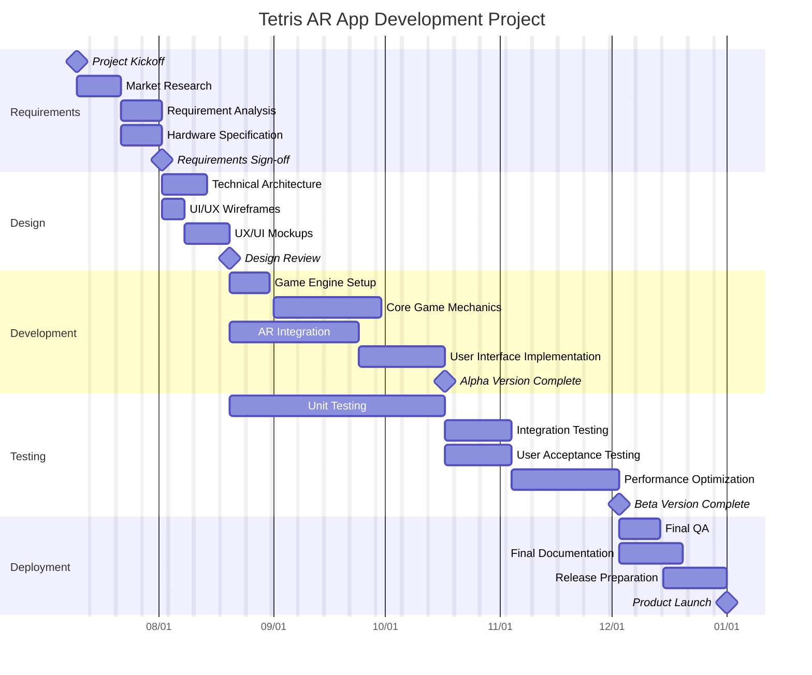

# Tetris AR App Project Plan

## Project Overview

This project aims to develop a Tetris game for AR glasses. The application will transform the classic 2D Tetris experience into an immersive 3D augmented reality game where blocks appear in the user's physical space. The game will utilize gesture controls and head movements for gameplay, targeting AR early adopters and casual gamers. Development will focus on core Tetris mechanics, AR integration, intuitive controls, and basic multiplayer functionality, with a 6-month development timeline.

## Gantt Chart

